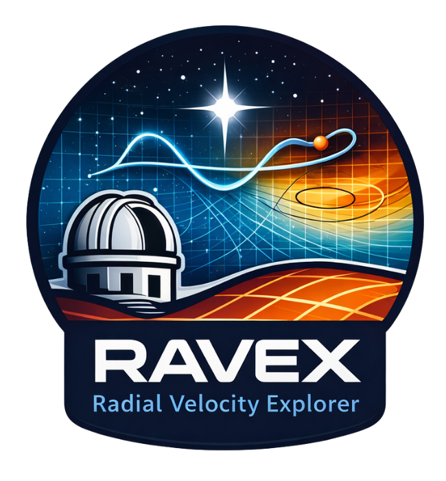

# ravex

<p align="center">
  
</p>

**RAdial VElocity eXplorer**

`ravex` is a Python package for simulating and analyzing radial-velocity (RV) observations of planetary systems.

It is designed for research-oriented RV workflows, including synthetic multi-planet time-series generation, signal injection and recovery, mass-precision forecasting, and detectability studies in period–mass space. It is particularly intended for feasibility studies of exoplanet observations with specific instruments (CARMENES, MAROON-X, etc.), and for the preparation of observing proposals.

---

## Authors

- **Lead developer:** Francisco J. Pozuelos (IAA-CSIC)
- **Contributor:** Roberto Varas (IAA-CSIC)

---

## Overview

`ravex` provides a compact framework to:

- simulate Keplerian RV signals for one or more planets,
- generate synthetic observing cadences,
- inject realistic noise into RV measurements,
- estimate RV precision for specific instruments,
- evaluate signal recovery with generalized Lomb–Scargle periodograms,
- track detection significance as a function of the number of observations,
- build injection–recovery detectability maps,
- accelerate large detectability grids through multiprocessing.

The package is currently organized around the `MultiPlanetSystem` class and a small set of supporting utility functions.

---
## Scientific applications

`ravex` has been used to support radial-velocity follow-up planning, mass-precision forecasts, and detectability analyses in the context of real exoplanetary systems. These applications illustrate the intended use of `ravex` as a research-oriented tool for designing RV observing strategies, estimating the number of measurements required to reach a target mass precision, and exploring detectability in period--mass parameter space.

Examples include:

- [Peláez-Torres et al. 2026, *A gem system with a lava world and a habitable zone sub-Neptune orbiting TOI-1752*](https://ui.adsabs.harvard.edu/abs/2026arXiv260415816P/abstract)  
  RV follow-up prospects and mass-measurement feasibility for a multi-planet system including a short-period lava-world candidate and a habitable-zone sub-Neptune.

- [Morello et al. 2026, *The K-dwarfs Survey I. Four Validated Planets from the Radius Valley to the Neptune Desert*](https://ui.adsabs.harvard.edu/abs/2026MNRAS.tmp..176M/abstract)  
  RV mass-precision forecasts and follow-up prioritization for validated transiting planets around K-dwarf stars.

- [Barkaoui et al. 2025, *TOI-7166 b: a habitable zone mini-Neptune planet around a nearby low-mass star*](https://ui.adsabs.harvard.edu/abs/2025MNRAS.544.2637B/abstract)  
  Feasibility assessment for radial-velocity follow-up of a nearby habitable-zone mini-Neptune.
  
---

## Citation

If you use `ravex` in your research, please cite the archived software release:

[](https://doi.org/10.5281/zenodo.19797144)

For the first public release, please cite:

Pozuelos, F. J., & Varas, R. (2026). `ravex`: RAdial VElocity eXplorer, v0.1.0. Zenodo. [https://doi.org/10.5281/zenodo.19797145](https://doi.org/10.5281/zenodo.19797145)
---

## Current features

### RV simulation
- Multi-planet Keplerian RV simulations
- Support for specifying planets through orbital period or semi-major axis
- Optional BJD conversion from JD when observatory location and target coordinates are provided
- True-anomaly computation and RV model evaluation
- Per-planet phased RV views for visualization and fitting

### Synthetic observations
- Random observing-date generation over a user-defined time span
- Gaussian RV noise injection
- Flexible handling of scalar or per-point RV uncertainties

### Recovery and detectability analysis
- GLS-based periodic signal recovery
- FAP-to-sigma conversion helpers
- Bootstrap-based FAP estimation
- Detection-growth curves
- Detectability tracking as a function of the number of observations
- Injection–recovery detectability maps in period vs. minimum-mass space
- Parallelized detectability-map computation

### Fitting and forecasting
- Mass-precision forecasting through repeated synthetic campaigns
- Recovery of sinusoidal amplitudes from time series
- Model interpolation in orbital phase for fitting workflows

### Instrumental utilities
- Empirical CARMENES VIS RV error estimator
- Empirical MAROON-X SERVAL RV error estimator

### Plotting and persistence
- Detection-growth plotting utilities
- Detectability-map plotting utilities
- CSV save/load helpers for `precision_tracker` outputs

---

## Installation

From the repository root:

```bash
/usr/bin/python3 -m pip install -e .


```

This installs `ravex` in editable mode, which is convenient during active development.

---

## Dependencies

The current version depends on:

- `numpy`
- `scipy`
- `astropy`
- `matplotlib`
- `pandas`

These dependencies are declared in `pyproject.toml`.

---

## Package layout

```text
ravex/
├── LICENSE
├── README.md
├── pyproject.toml
├── .gitignore
├── examples/
└── src/
    ├── ravex/
    │   ├── __init__.py
    │   └── core.py
    └── ravex.egg-info/
```

---

## Public API

At the moment, the main public entry points are:

```python
from ravex import MultiPlanetSystem
from ravex import carm_error
from ravex import maroonx_serval_error
from ravex import plot_detection_growth_strict
from ravex import plot_detectability_map
from ravex import save_precision_tracker_to_csv
from ravex import load_precision_tracker_from_csv
```

Advanced or internal helpers remain available through `ravex.core` if needed.

---

## Notes

- `ravex` is currently focused on research use and active development, not on polished end-user packaging.
- Some APIs may still evolve as the project gains examples, tests, and more documentation.
- The present implementation is best suited for synthetic RV studies, detectability forecasts, and injection–recovery experiments.

---

## Contributing

Contributions, suggestions, and issue reports are welcome.

During this early stage, the most useful contributions are likely to be:

- bug reports,
- API feedback,
- documentation improvements,
- example notebooks,
- validation against benchmark RV use cases.

---

## License

This project is distributed under the BSD 3-Clause License.

A LICENSE file is included in the root of the repository.


---

## AI-assisted development

Parts of the development of `ravex` were carried out with the assistance of **ChatGPT (GPT-5.4 Thinking)**.

AI-assisted contributions included, among others:

- code review,
- debugging,
- refactoring suggestions,
- optimization of computational routines,
- documentation drafting and polishing,
- package-structure and repository organization support.

The scientific design, methodological choices, validation, and final decisions regarding the code and its use remain the responsibility of the lead developer.

---

## Status

Current development stage: **v0.1.0**

